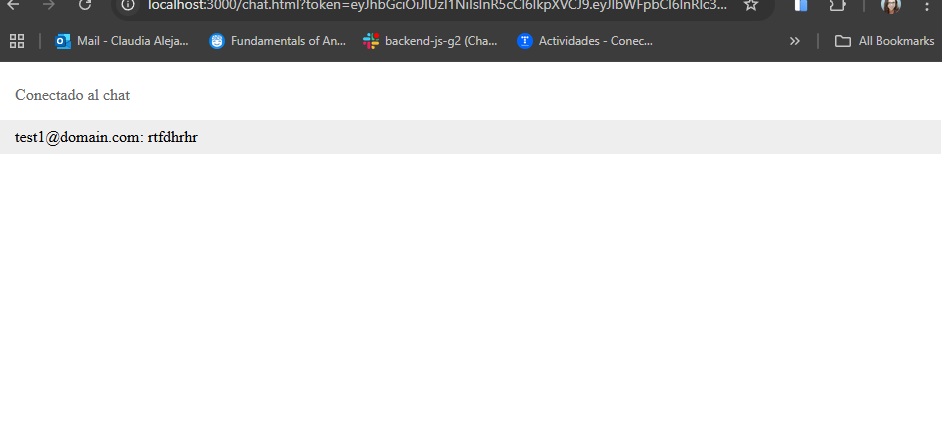

# Hito Uno

Este proyecto es una aplicación web que implementa rutas protegidas y libres utilizando Node.js y Express. Su objetivo es demostrar el manejo de autenticación y permisos para navegar entre diferentes rutas.

---

## Características

- **Ruta libre:** accesible para todos los usuarios.
- **Rutas protegidas:** solo accesibles para usuarios autenticados.
- **Control de acceso:** implementado mediante autenticación con JSON Web Tokens (JWT).
- **Chat en tiempo real:** utilizando Socket.io.
- **Documentación de API:** generada con Swagger.

---

## Requisitos previos

Antes de comenzar, asegúrate de tener instalado en tu sistema:

- **Node.js** (versión 16 o superior) y npm (incluido con Node.js).
- Un editor de texto como [VS Code](https://code.visualstudio.com/).
- [Git](https://git-scm.com/) si deseas clonar este repositorio.

---

## Instalación

1. **Clona el repositorio**  
   Si aún no tienes el repositorio en tu máquina, usa el siguiente comando:
   ```bash
   git clone https://github.com/Ninakiau/hitouno.git
   ```

2. **Navega al directorio del proyecto**  
   ```bash
   cd hitouno
   ```

3. **Cambia a la rama `hitoseis`**  
   ```bash
   git checkout hitoseis
   ```

4. **Instala las dependencias necesarias**  
   Este comando instalará todas las dependencias listadas en el archivo `package.json`:
   ```bash
   npm install
   ```

---

## Desarrollo

Para iniciar el proyecto en modo desarrollo, usa el siguiente comando:
```bash
npm run dev
```

Esto levantará un servidor local en `http://localhost:3000/`.

Puedes revisar la documentación de la API en Swagger en la siguiente URL:
```plaintext
http://localhost:3000/api/v1/api-docs/#/
```

---

## Tecnologías utilizadas

- **Backend:** Node.js, Express
- **Autenticación:** JWT
- **Chat en tiempo real:** Socket.io
- **Documentación de API:** Swagger

---

## Pruebas del chat

Para probar el chat, sigue estos pasos:

1. Inicia sesión en Swagger con tu email y contraseña.
2. Obtén el token de autenticación.
3. Conéctate a la URL del chat pegando tu token en la siguiente dirección:
   ```plaintext
   http://localhost:3000/chat.html?token=TU_TOKEN
   ```

---

## Autor

Creado por **Claudia** - [GitHub](https://github.com/Ninakiau).

