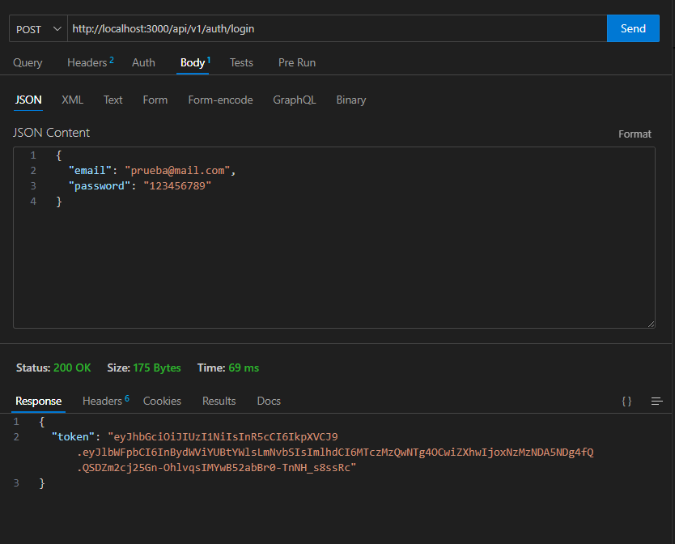

# Hito Uno

Este proyecto es una aplicación web que implementa rutas protegidas y libres utilizando node y express. Su objetivo es demostrar el manejo de autenticación y permisos para navegar entre diferentes rutas.

---

## Características

- **Ruta libre:** accesible para todos los usuarios.
- **Rutas protegidas:** solo accesibles para usuarios autenticados.
- Ejemplo de control de acceso mediante autenticación.

---

## Requisitos previos

Antes de comenzar, asegúrate de tener lo siguiente instalado en tu sistema:

- **Node.js** (versión 16 o superior) y npm (incluido con Node.js).
- Un editor de texto como [VS Code](https://code.visualstudio.com/).
- [Git](https://git-scm.com/) si deseas clonar este repositorio.

---

## Instalación

1. **Clona el repositorio**  
   Si aún no tienes el repositorio en tu máquina, usa el siguiente comando:  
   ```bash
   git clone https://github.com/Ninakiau/hitouno.git
   ```

2. **Navega al directorio del proyecto**  
   ```bash
   cd hitouno
   ```
3. **Cambia a la rama hitodos**
   ```bash
   git checkout hitodos
   ```
4. **Instala las dependencias necesarias**  
   Este comando instalará todas las dependencias listadas en el archivo `package.json`:  
   ```bash
   npm install
   ```

---

## Desarrollo

Para iniciar el proyecto en modo desarrollo, usa el siguiente comando:  
```bash
npm run dev
```

Esto levantará un servidor local (normalmente en `http://localhost:3000/`), donde podrás ver los cambios reflejados automáticamente mientras trabajas en el proyecto.

---


## Uso de las Rutas

- **Ruta libre:**  
  Puedes acceder a esta ruta sin necesidad de autenticación.

  ### Registro
  - **URL:** `http://localhost:3000/api/v1/auth/register`
  

  ### Login
  - **URL:** `http://localhost:3000/api/v1/auth/login`
  
  *Obtenemos el token*

  ### Traer los gatos 
  - **URL:** `http://localhost:3000/api/v1/cats`


  ### Traer 1 gato por id
  - **URL:** `http://localhost:3000/api/v1/cats/:id`

- **Rutas protegidas:**  
  Estas rutas requerirán que el usuario haya iniciado sesión previamente. Si no está autenticado, será redirigido automáticamente a la página de inicio de sesión.

  ### Traer todos los usuarios
  - **URL:** `http://localhost:3000/api/v1/users`
  

  ### Crear un gato


**Si no hay token**


---

## Tecnologías utilizadas
- **Backend:** [Node.js, Express]
- **Autenticación:** [JWT]


## Autor

Creado por Claudia - [GitHub](https://github.com/Ninakiau).

---

